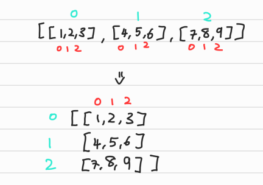
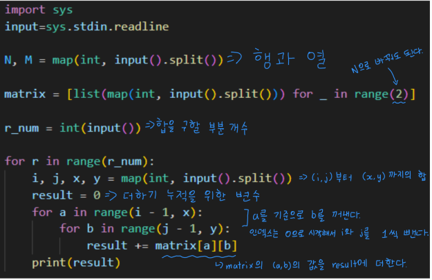

# 📋 Algorithm - 이차원 리스트

[이차원 리스트](#%EF%B8%8F-이차원-리스트)

​	[특정 값으로 최기화 된 이차원 리스트 만들기](#특정-값으로-최기화-된-이차원-리스트-만들기)

[입력 받기](#%EF%B8%8F-입력-받기)

​	[유니크](#5533-유니크)

​	[2차원 배열의 합](#2167-2차원-배열의-합)


##  ✔️ 이차원 리스트

> 이차원 리스트는 리스트를 원소로 가지는 리스트다
>
> 세상을 표현하는 리스트라고 할 수 있다
>
> 이차원 리스트는 행렬 (Matrix)

```python
matrix = [[1, 2, 3], [4, 5, 6], [7, 8, 9]]
# 리스트 안에 리스트

print(matrix[0][1])
# 2
print(matrix[1][1])
# 5

# 보기 좋게 행렬(matrix)의 형태
matrix = [
    [1, 2, 3],
    [4, 5, 6],
    [7, 8, 9]
]
```




### 특정 값으로 최기화 된 이차원 리스트 만들기

- #### 직접 작성

```python
matrix = [[0, 0, 0], [0, 0, 0], [0, 0, 0]]

matrix1 = [
    [0, 0, 0],
    [0, 0, 0],
    [0, 0, 0]
]
# 수가 많아지면 직접 입력하기 힘들다
```

- #### 반복문으로 작성

```python
matrix = []

for _ in range(100):
    matrix.append([0] * 100)
    
------------------------------------
n = 4
m = 3
matrix = []

for i in range(n):
    matrix.append([0] * m)

# n은 열의 개수
# m은 행의 개수
```

- #### 리스트 컴프리헨션으로 작성

```python
n = 4
m = 3

matrix = [[0] * m for _ in range(n)]

# [0] * m 에 input()을 넣어 입력값을 넣을 수 있다
```


**📌 단, 주의하기**

```python
n = 4
m = 3

matrix = [[0] * m for _ in range(n)]
matrix = [[0] * m] * 3
```

- 둘 다 같아 보이지만 다르다
  - 첫 번째, matrix는 리스트 안에 리스트들이 다 다르다
    - `matrix[0][0] = 1` 이 있으면 `matrix[0][0]`에만 1이 넣어진다
  - 두 번째, matrix는 리스트 안에 리스트들이 다 똑같다
    - `matrix[0][0] = 1`이 있으면 3개의 리스트의 첫번째 인덱스에 모두 1이 들어간다


## ✔️ 입력 받기

```python
# 3x3 크기의 입력을 받아보기

# 1 2 3
# 4 5 6
# 7 8 9

matrix = [list(map(int, input().split())) for _ in range(3)]

---------------------------------------------------

# n X m 크기 입력 받기

# 3 4
# 1 2 3 4
# 5 6 7 8
# 9 0 1 2

n, m = map(int, input().spilt())

matrix = [list(map(int, input().split())) for _ in range(n)]

# or

matrix = []
for _ in range(n):
    line = list(map(int, input().split()))
    matrix.append(line)
```


### 5533 유니크 

```python
T = int(input())

matrix = [[], [], []]

for t in range(T):
    a, b, c = map(int, input().split())
    matrix[0].append(a)
    matrix[1].append(b)
    matrix[2].append(c)

pprint(matrix)
# [[100, 100, 63, 99, 89], 
#  [99, 97, 89, 99, 97], 
#  [98, 92, 63, 99, 98]]

scores = []

for i in range(T):
    score = 0
    for j in range(3):
        if matrix[j].count(matrix[j][i]) == 1:
            score += matrix[j][i]
    scores.append(score)
    # [0, 92, 215, 198, 89]

print(scores)
```


#### 2167 2차원 배열의 합

```python
N, M = map(int, input().split())

matrix = [list(map(int, input().split())) for _ in range(2)]

r_num = int(input())

for r in range(r_num):
    i, j, x, y = map(int, input().split())
    result = 0
    for a in range(i - 1, x):
        for b in range(j - 1, y):
            result += matrix[a][b]
    print(result)
```



- 이중 for문을 사용 한 후,
  - `matrix[a][b]` 사용하기
