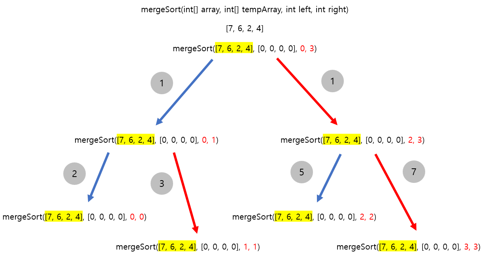
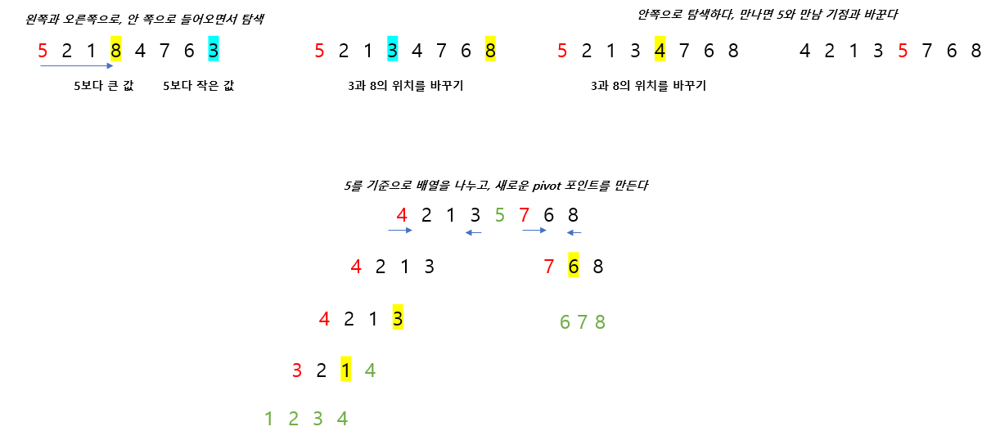

# [Java] 알고리즘 정렬


#### 정렬은 데이터들을 순서대로 배치하는 방법이다

- 오름차순 또는 내림차순으로 배치를 할 수 있다


#### 버블 정렬, 삽입 정렬, 선택 정렬, 합병 정렬, 힙 정렬, 퀵 정렬, 트리 정렬, 팀정렬, 블록 병합 정렬, 인트로 정렬, 기수 정렬, 카운팅 정렬, 셸 정렬, 보고 정렬 등이 있다


## 버블 정렬

#### 연속되는 2 숫자를 비교해서, 더 큰 수가 있으면, 뒤에 있는 수와 바꾸는 것이다

- 그렇게 제일 큰 숫자가 제일 뒤로 가게 되고, 오름차순으로 정렬이 된다


#### 알고리즘 복잡도는 O(n^2) 다


```java
public static void swap(int[] array, int from, int to) {
    int tempNum = array[from];
    array[from] = array[to];
    array[to] = tempNum;
}

public static void bubbleSort(int[] array) {
    for(int i = 1; i < array.length - 1; i++) {
        for (int j = 0; j < array.length - i; j++) {
            if (array[j] > array[j + 1]) {
                swap(array, j, j+1);
            }
        }
    }
}
```


## 삽입 정렬

#### 인덱스 1로 시작하여, 앞의 숫자보다 뒤의 숫자가 작으면 작은 숫자를 앞으로 가지고 오는 것이다


#### 삽입 정렬 같은 경우, 앞의 숫자보다 크다면, 거기서 break를 걸어서, 실행 시간을 조금이라도 줄여준다


#### 최악의 경우 O(n ^ 2) 다


```java
public static void swap(int[] array, int from, int to) {
    int tempNum = array[from];
    array[from] = array[to];
    array[to] = tempNum;
}

public static void insertionSort(int[] array) {
    for (int i = 1; i < array.length; i ++) {
        for (int j = i ; j > 0; j--) {
            if (array[j] < array[j - 1]) {
                swap(array, j, j-1);
            } else {
                break;
            }
        }
    }
}
```


## 선택 정렬

#### 데이터들을 순회하면서 제일 작은 숫자를 앞으로 이동시키는 것이다

- 그렇게 한번 제일 앞으로 이동 시키면, 그 숫자는 고정이 되고, 다음 인덱스부터 배열 끝까지의 데이터 중 제일 작은 숫자를 찾아서 똑같이 앞으로 이동시킨다


#### 위를 반복하면 오름차순으로 정렬이 된다


```java
public static void swap(int[] array, int from, int to) {
    int tempNum = array[from];
    array[from] = array[to];
    array[to] = tempNum;
}

private static void selectionSort(int[] array) {
    for (int i = 0; i < array.length; i++) {
        int minNum = array[i];
        int minIdx = -1;
        for (int j = i; j < array.length; j ++) {
            if (array[j] < minNum) {
                minNum = array[j];
                minIdx = j;
            }
        }

        swap(array, minIdx, i);
    }
}
```


## 합병 정렬 (Merge Sort)


### 그림 설명




#### 동그라미 숫자를 보면서 이해할 것

1. **[7, 6, 4, 2]** 배열을 반씩 쪼개는 작업을 시작한다 (실제로 배열을 쪼개는 것이 아니라, 인덱스를 활용하는 것이다)

   - **콜스택**
     - mergeSort([7, 6, 2, 4], [0, 0, 0, 0], 0, 3) 
     - mergeSort([7, 6, 2, 4], [0, 0, 0, 0], 0, 1) - 윗 부분

2. 2번의 **left** 인덱스와 **right** 인덱스가 같아졌음으로 왼쪽 분할에 대한 것은 끝낸다. 콜스택에서 윗 부분을 뺀다

   - **콜스택**
     - mergeSort([7, 6, 2, 4], [0, 0, 0, 0], 0, 3) 
     - mergeSort([7, 6, 2, 4], [0, 0, 0, 0], 0, 1) 
     - mergeSort([7, 6, 2, 4], [0, 0, 0, 0], 0, 0) - 윗 부분 (빼기)

3. mergeSort([7, 6, 2, 4], [0, 0, 0, 0], 0, 1) 스택 부분에서 3번, 또 다른 값이 존재하기 때문에, 오른쪽으로 한 칸 내려간다

   - **콜스택**

     - mergeSort([7, 6, 2, 4], [0, 0, 0, 0], 0, 3) 

     - mergeSort([7, 6, 2, 4], [0, 0, 0, 0], 0, 1) 

     - mergeSort([7, 6, 2, 4], [0, 0, 0, 0], 1, 1) - 윗 부분 (빼기)

4. merge 함수를 실행한다 => **merge([7, 6, 2, 4], [0, 0, 0, 0], 0, 1, 0)**

   - 임시 배열 [0, 0, 0, 0] 에는 [6, 7, 0, 0] 이 저장된다
   - 그리고 임시 배열을 원래 배열에다 갱신을 해주면 된다 ([6, 7, 2, 4] - 원래 배열이 갱신 되었을 때)


**5번부터 8번까지, 위에 공식을 반복하면 된다.**

- 재귀 함수를 사용하면, 콜스택에 break문에 도달할 때까지 쌓이게 된다.
- break문을 도달했을 때에, 콜스택에서 하나씩 꺼내서 값을 반환해주면 된다. 


```java
public static void mergeSort(int[] array, int[] tempArray, int left, int right) {
    if (left < right) {
        int midIdx = (right + left) / 2;
        // 왼쪽 분할
        mergeSort(array, tempArray, left, midIdx);
        // 오른쪽 분할
        mergeSort(array, tempArray, midIdx + 1, right);

        // 모든 숫자들이 하나씩 분할이 된 상태면, 합치면 된다
        merge(array, tempArray, left, right, midIdx);
    }
}

public static void merge(int[] array, int[] tempArray, int left, int right, int midIdx) {
    int l = left;
    int r = midIdx + 1;
    int idx = l;

    while (l <= midIdx || r <= right) {
        if (l <= midIdx && r <= right) {
            if (array[l] <= array[r]) {
                tempArray[idx ++] = array[l ++];
            } else {
                tempArray[idx ++] = array[r ++];
            }
        } else if (l <= midIdx && r > right) {
            tempArray[idx ++] = array[l ++];
        } else {
            tempArray[idx ++] = array[r ++];
        }
    }

    for (int i = left; i <= right; i++) {
        array[i] = tempArray[i];
    }
}
```


## 퀵 정렬 (Quick Sort)

#### 분할 정복 알고리즘 중 하나다

#### 피봇 (pivot) 을 기준으로, 좌우를 나누어서 정렬을 하는 방식이다





#### 인덱스, left, right을 가지고 (투포인터처럼) 배열을 순회하면서 정렬을 하는 것이다


```java
public static void swap(int[] array, int from, int to) {

    int tempNum = array[from];
    array[from] = array[to];
    array[to] = tempNum;

}

public static void quickSort(int[] array, int left, int right) {
    if (left >= right) {
        return;
    }

    int pivot = partition(array, left, right);

    quickSort(array, left, pivot - 1);
    quickSort(array, pivot + 1, right);
}

public static int partition(int[] array, int left, int right) {
    int pivot = array[left];
    int l = left;
    int r = right;

    while (l < r) {
        while (array[r] > pivot && l < r) {
            r--;
        }

        while (array[l] <= pivot && l < r) {
            l ++;
        }

        swap(array, l, r);
    }

    swap(array, left, l);

    return r;
}
```


