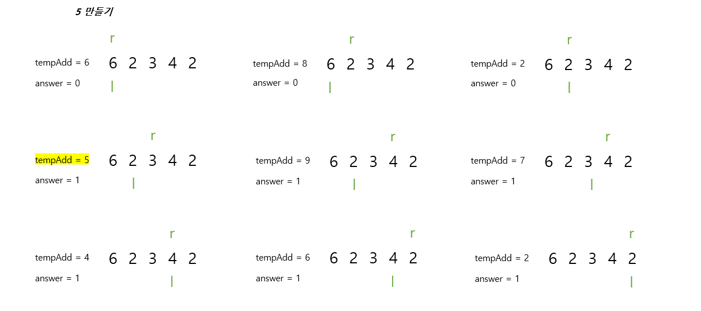

# 20230703 [Java] 문제풀이 


## [Baekjoon 1254] 팰린드롬 만들기

#### 주어진 단어의 인덱스를 순회를 한다


### 해당 인덱스부터, 단어 끝까지, 팰린드롬이 성사하는지 확인을 한다

- aaabab가 주어진다
- string.substring(0) - aaabab (팰린드롬이 아님)
- string.substring(1) - aabab (팰린드롬이 아님)
- string.substring(2) - abab (팰린드롬이 아님)
- string.substring(3) - bab (팰린드롬이다)


#### 그렇게 팰린드롬이 주어지면, answer = string.substring(palindromIdx).length() + (palindromIdx * 2); 을 한다

- 팰린드롬 단어의 길이 + 팰린드롬을 찾기 전 단어의 개수와 팰린드롬을 만들기 위해 추가해야 하는 단어 (* 2)


#### 팰린드롬이 없으면, 그냥 글자 수에 * 2 를 한 후에 1을 빼면 된다


```java
import java.util.*;
public class Baekjoon1254 {
    public static boolean palindrom(String string) {
        if (string.length() == 1) {
            return false;
        }

        int i = 0;
        int j = string.length() - 1;

        while (i <= j) {
            if (string.charAt(i) != string.charAt(j)) {
                return false;
            }

            i ++;
            j --;
        }

        return true;
    }
    
    public static void main(String[] args) {

        Scanner scanner = new Scanner(System.in);

        String string = scanner.next();
        int palindromIdx = -1;
        int answer = 0;

        for (int i = 0; i < string.length(); i++) {
            if (palindrom(string.substring(i))) {
                palindromIdx = i;
                break;
            }
        }

        if (palindromIdx != -1) {
            answer += string.substring(palindromIdx).length() + (palindromIdx * 2);
        } else {
            answer += (string.length() * 2) - 1;
        }

        System.out.println(answer);
    }
}
```


## [백준 2167] 2차원 배열의 합

#### 두 개의 좌표 사이의 합을 구하는 것


#### 2중 for문을 사용하면 되는 문제


```java
import java.util.*;
public class Baekjoon2167 {
    public static void main(String[] args) {
        Scanner scanner = new Scanner(System.in);

        int n = Integer.parseInt(scanner.next());
        int m = Integer.parseInt(scanner.next());

        int[][] matrix = new int[n][m];

        for (int x = 0; x < n ; x++) {
            for(int y = 0; y < m; y++) {
                matrix[x][y] = Integer.parseInt(scanner.next());
            }
        }

        int test = scanner.nextInt();

        for (int i = 0; i < test; i ++) {
            int answer = 0;
            int startx = Integer.parseInt(scanner.next()) - 1;
            int starty = Integer.parseInt(scanner.next()) - 1;
            int finishx = Integer.parseInt(scanner.next()) - 1;
            int finishy = Integer.parseInt(scanner.next()) - 1;

            for (int x = startx; x <= finishx; x ++) {
                for (int y = starty; y <= finishy; y++) {
                    answer += matrix[x][y];
                }
            }

            System.out.println(answer);
        }
    }
}
```


## [백준 2003] 수들의 합

#### 투 포인터를 사용한다


#### 왼쪽 시작부터 두 개의 포인터로 시작을 한다





#### tempAdd가 만드려는 숫자 m 보다 크거나 같으면 r 인덱스를 1을 더한다

- r이 움직일때마다 tempAdd에 새로운 인덱스의 값을 추가해준다


#### tempAdd가 m 보다 작으면 l 인덱스를 1씩 더한다

- l이 하나씩 움직일 때, 전에 array[l] 을 tempAdd에서 빼줘야 한다


#### r 인덱스가 먼저 끝 지점에 도착하게 된다면, l 만 1씩 더하면서 m이 나오는지 안 나오는지 확인을 한다

```java
import java.util.*;

public class Main {
    public static void main(String[] args) {
        Scanner scanner = new Scanner(System.in);

        int n = Integer.parseInt(scanner.next());
        int m = Integer.parseInt(scanner.next());

        int[] array = new int[n];

        for (int i = 0; i < n; i++) array[i] = Integer.parseInt(scanner.next());

        int left = 0;
        int right = 0;
        int answer = 0;
        int tempAdd = array[left];

        while (left < n) {
            if (tempAdd <= m) {
                if (tempAdd == m) answer += 1;

                if (right + 1 < n) {
                    right ++;
                    tempAdd += array[right];
                } else {
                    tempAdd -= array[left];
                    left ++;
                }
            } else if (tempAdd > m) {
                tempAdd -= array[left];
                left ++;
            }
        }
        System.out.println(answer);

    }
}
```


## [백준 11047] 동전 0

#### 동전은 오름차순으로 받는다


#### 필요한 동전 개수의 최솟값을 구하는 것이니깐, 배열 맨 뒤에서, 즉 동전의 값이 제일 큰 것부터 비교한다


#### 만약 해당 동전이 K보다 작으면, 그 동전을 사용한다

- 사용한 동전만큼 K에 갱신을 시킨다 (빼면 됨)


#### 그렇게 K가 0이 될 때까지 for문을 실행을 시키면 된다


```java
import java.util.*;

public class Baekjoon11047 {
    public static void main(String[] args) {
        Scanner scanner = new Scanner(System.in);

        int n = Integer.parseInt(scanner.next());
        int k = Integer.parseInt(scanner.next());

        int[] money = new int[n];

        for(int i = 0; i < n; i++) money[i] = Integer.parseInt(scanner.next());

        int answer = 0;

        for(int i = n - 1; i >= 0; i--) {
            if (k >= money[i]) {
                answer += k / money[i];
                k -= (k / money[i]) * money[i];

                if (k == 0) {
                    break;
                }
            }
        }

        System.out.println(answer);

    }
}
```


