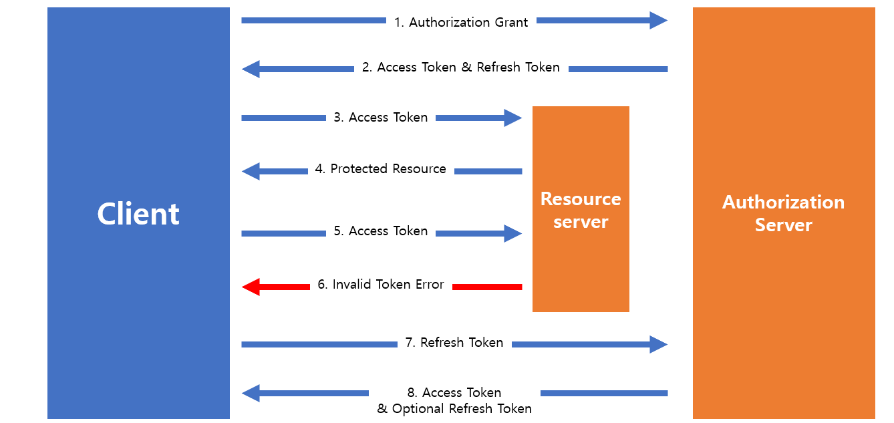

# 스프링 회원기능

#### 회원기능을 구현하는 방법은 크게 Session과 Token 방법이 있다

- Session
- 토큰 방식 (JWT)

#### 로그인 구현

- 클라이언트가 로그인을 하게 되면, 서버에서는 클라이언트에게 권한을 부여한다
- 여기서 권한, 입장권 같은 내용을 가지고 서버에서 권한이 필요한 기능이면, 해당 입장권을 통해 그 기능을 클라이언트가 사용할 수 있게 된다

#### Session vs Token

- **세션**은 따로 메모리나 DB에 로그인한 내용을 저장한다
  - 즉 클라이언트가 요청을 보낼 때 마다, DB를 계속 확인을 해야 한다
  - 유저가 늘어나면 서버에 부하가 일어날 수 있다
- **토큰**은 세션보다 입장권 내용에 더 많은 내용들이 들어가 있다
  - 서버에서는 토큰만 확인을 하면 된다

## JWT (Json Web Token)

#### Header

- 토큰의 타입 (JWT)
- 어떤 암호화 알고리즘이 적용이 되어 있는지 명시되어 있다

#### Payload

- 사용자나 토큰에 대한 특성 정보가 들어가 있다 (토큰 만료 시간, 로그인 한 사용자의 이름)
- JWT 토큰은 한번 만들어지면 상태나 토큰에 대한 정보를 서버에서 관리하지 않는다
  - 그래서 만료 시간이 꼭 필요하다
  - 만료 시간이 없으면, 임의로 서버에서 삭제를 할 수 없어서, 유출이 되면 위험해진다
- JWT 토큰을 가지고 있으면, 누구나 디코딩을 할 수 있다

#### Signature

- 토큰이 유효한지, 또는 위조가 되었는지 확인을 해준다

#### 문제

- Header
  - 알고리즘을 none으로 사용하면 보안에 문제가 생기게 된다
  - 그리고 유저들이 토큰을 만들 때에 알고리즘을 none으로 수동으로 바꾸지 못 하게 해야 한다
- JWT는 디코딩이 매우 간단하다
  - 최소한의 정보를 Token에 넣는 것이 제일 좋다
- secret-key
  - 시크릿키를 만들어서 토큰에 넣어야 하는데, 그 시크릿키를 만들 때에, 너무 간단하게 만들면 안 좋다
  - 시크릿키를 뺏기면, 유저가 토큰을 마음대로 만들 수 있다
  - 길게 만들거나, 공유를 하지 말자
  - 생성용키 / 검증용키 2개를 사용한다 (private key + public key)
- JWT를 탈취해갈 수 있다
  - 이 때는 주로, 유저의 잘못으로 크게 신경을 안 써도 된다

#### JWT는 stateless 해서, 토큰이 다른 유저에 의해 탈취가 되더라도 회수 또는 정지하는 것이 어렵다

- 훔치기 어려운 저장소에 저장을 해 놓는다
- JWT 블랙리스트를 만들어서, 서버에서 특정 토큰은 못 들어오도록 한다
  - 세션 방법과 비슷해져서, 비추천
- JWT의 유효기간을 매우 짧게 설정을 해 놓는다 (예. 5분, 은행권 또는 정부 사이트에 들어가면 로그인 시간이 짧은 것을 볼 수 있다)
  - 이를 이용하기 위해서는 **Refresh Token**을 사용해야 한다 (토큰 재발급) 
  - **Refresh Token Rotation** 를 사용한다

## Access Token 과 Refresh Token

#### Access Token은 말 그래도, 데이터 또는 자원을 서버에 접근 할 수 있도록 부여한 토큰이다

- Access Token은 로그인 시, 발행이 된다
- 하지만 해당 토큰은 다른 유저가 가로채 갈 수도 있어서, 유효 시간을 짧게 둔다
- 유효 시간이 짧다는 것은, 로그인을 계속 해야 한다는 것이다 (예) 1시간에 한번)

#### Refresh Token은 Access Token을 재발행 받을 수 있게 해주는 토큰이다

- Refresh Token은 Access Token보다 생명주기가 길게 설정이 되어 있다
- Access Token의 유효 시간이 지나면, Refresh Token을 통해 다시 자동으로 인증을 하고, Access Token을 새로 생성하게 된다

1. 클라이언트가 데이터를 사용하기 위해 로그인을 한다
2. 인증 서버에서, 클라이언트에게 Access Token과 Refresh Token을 제공한다
   - 여기서 Refresh Token은 주로 Redis에 저장한다
3. 클라이언트는 이제 데이터를 가지고 올 때에, Access Token을 계속 사용한다
4. 인증된 클라이언트에게 서버에서 데이터를 응답해준다
5. 유효 기간이 지난 Access Token으로 자원 서버에 요청
6. 유효 기간이 지나, 서버의 자원을 사용할 수 없게 된다
7. 그렇게 되면 클라이언트에서는 인증 서버에 Refresh Token으로 인증을 하여, 서버 사용에 대한 허가를 요청한다
   - 이때는 로그인 없이 진행이 된다
8. Refresh Token의 유효 기간이 지나지만 않았다면, 새로운 Access Token을 발급해준다.
   - Refresh Token 재발급은 다시 새로 만들어줘도 되고, 안 그래도 된다
