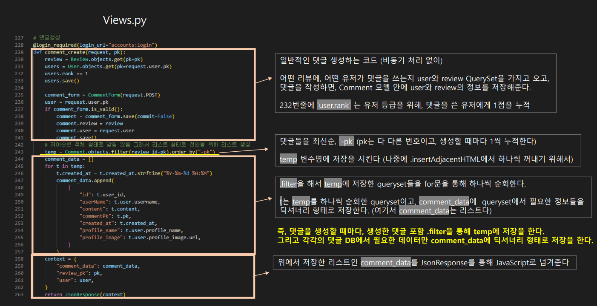
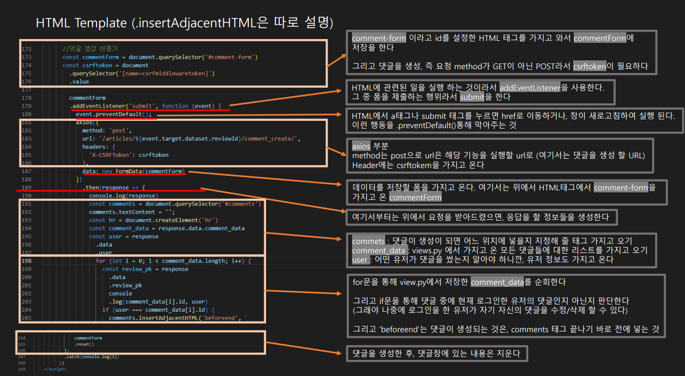

# 🧑‍💻 최종 프로젝트 1

[최종 프로젝트 URL]()

[def search](#def_html)

- [pagination 기능](#pagination_기능)
- [search 기능](#search_기능)
- [인기검색어 기능](#인기검색어_기능)
- [Arrange 기능](#arrange_기능)

[비동기](#비동기)

- [댓글 비동기](#댓글_비동기)
- [댓글 삭제 비동기](#댓글_삭제_비동기)
- [댓글 수정 비동기](#댓글_수정_비동기)


## ✔️ 프로젝트 하면서 학습한 것

### ✍️ API

> #### Application Protocol Interface
>
> 프런트가 화면에서 보이는 것 들이고, 백은 해당 서버에서 필요한 데이터이다.
>
> - Front에서 Back으로 정보를 요청하고, Back 정보를 찾아 Front에 보내면, Front에서 해당 정보를 보여준다
> - Front에서 Back으로 정보를 특정한 규칙을 맞춰 제공하는 것이 API이다.
>
> Open API
>
> - Open API를 사용하는 것은, 이미 만들어진 데이터들을, 데이터들을 제공하는 사이트의 기준에 맞춰서 사용하는 것이다
>   - 예시로 **지도, 결제, 채팅, AI** 가 있다

### ✍️ from django.db.models import Q

> 주로 `.filter` ORM을 사용할 때, 어떠한 정보를 찾을 때 사용한다
>
> 주로 `| & ^` 를 사용한다 (순서대로, and, or, xor)
>
> 예시)
>
> ORM : `Q(question__startswith='Who') | Q(question__startswith='What')`
>
> SQL : `WHERE question LIKE 'Who%' OR question LIKE 'What%'`

### ✍️ def search

> ### Search의 모델

```python
class Search(models.Model):
    # 검색할 때, 받는 필드
    title = models.CharField(max_length=10)
    # 검색어를 위해 필요한 필드
    count = models.PositiveIntegerField(default=0)
```


> ### views.py (전체를 가지고 온 것)

```python
def search(request):
    popular_list = {}
    if request.method == "GET":
        search = request.GET.get("searched", "")
        sort = request.GET.get("sorted", "")
        
        if not search.isdigit() and not search == "":
            if Review.objects.filter(
                Q(title__icontains=search)
                | Q(content__icontains=search)
                | Q(place__icontains=search)
            ):
                popular_list[search] = popular_list.get(search, 0) + 1

        for k, v in sorted(popular_list.items(), key=lambda x: -x[1]):
            if Search.objects.filter(title=k):
                s = Search.objects.get(title=k)
                s.count += 1
                s.save()
            else:
                s = Search(title=k, count=v)
                s.save()
        popular = Search.objects.order_by("-count")[:10]

        search_list = Review.objects.filter(
            Q(title__icontains=search)
            | Q(content__icontains=search)
            | Q(place__icontains=search)
            | Q(theme__icontains=search)
            | Q(user_id__profile_name__icontains=search)
        )

        if search:
            if search_list:
                pass

            if sort == "pop":
                search_list = search_list.order_by("-like_users")
                sort="pop"
                print(search_list)

            if sort == "recent":
                search_list = search_list.order_by("-updated_at")
                sort="recent"
                print(search_list)

            page = int(request.GET.get("p", 1))
            pagenator = Paginator(search_list, 5)
            boards = pagenator.get_page(page)

            return render(
                request,
                "articles/search.html",
                {
                    "search": search,
                    # 페이별로 저장된 queryset을 가지고 온다
                    "boards": boards,
                    # 검색어에 대한, 검색된 queryset들의 리스트를 가지고 온다
                    "search_list": search_list,
                    # 검색이 많이 된 순으로 queryset을 정리해서 가지고 온다
                    "popular": popular,
                    # 특정 필드로 인해 정렬된 queryset들을 가지고 온다
                    "sort" : sort,
                },
            )
        else:
            k = "검색 결과가 없습니다 다시 검색해주세요"
            context = {"v": k}
            return render(request, "articles/searchfail.html", context)
```


#### pagination 기능

> 페이지를 나누는 기능

```python
from django.core.paginator import Paginator

page = int(request.GET.get("p", 1))
pagenator = Paginator(search_list, 5)
boards = pagenator.get_page(page)
```

- `from django.core.paginator import Paginator` 를 통해서 `Paginator` 모듈을 가지고 온다
- `page = int(request.GET.get("p", 1))` 
  - client가 요청한 url에 `p`, 페이지의 변수를 가지고 온다 (여기서 기본 설정은 1이다)
- `pagenator = Paginator(search_list, 5)`
  - `search_list`는 검색해서 받은 queryset들의 리스트들의 변수 명이다 (search 기능에서 확인 가능)
  - `search_list`를 한 페이지 당 5개씩 가지고 온다
- `boards = pagenator.get_page(page)`
  - `pagenator`에 저장한 queryset들 (여기서 5개)를 가지고 온다
  - `pagenator`는 각 페이지 당 5개씩 저장이 되어 있고, url에서 불러온 `p`의 값을 `boards`에 저장한다
- 📌📌📌**즉 `page`는 유저가 요청한 몇 번째 페이지 → `pagenator`는 각 페이지 당 몇개의 queryset을 저장할지 지정 → `boards`는 유저가 요청한 페이지의 queryset들을 가지고 온다**

##### **search.html**

```html
<div class="row mt-2">
  <div class="col-12 my-5">
    <nav aria-label="Page navigation example">
      <ul class="pagination justify-content-center">
        
          <li class="page-item">
            <a class="page-link" href="?searched={{ search }}&sorted={{ sort }}&p={{ boards.previous_page_number }}">이전</a>
          </li>
        
          <li class="page-item disabled">
            <a class="page-link" href="#">이전</a>
          </li>
        
        <li class="page-item">
          <a class="page-link" href="#">{{ boards.number }}
            /
            {{ boards.paginator.num_pages }}</a>
        </li>
        
          <li class="page-item">
            <a class="page-link" href="?searched={{ search }}&sorted={{ sort }}&p={{ boards.next_page_number }}">다음</a>
          </li>
        
          <li class="page-item disabled">
            <a class="page-link" href="#">다음</a>
          </li>
        
      </ul>
      </nav>
    </div>
  </div>
```

-  `href="?searched={{ search }}&sorted={{ sort }}&p={{ boards.previous_page_number }}"`
  - `a` 태그에 포함된 링크
  - 해당 링크를 클릭하면 지금 페이지의 이전 페이지의 정보를 가지고 온다
  - 예) 한국을 검색했고, 인기순으로 정렬후, 2번째 페이지를 찾아가기
    - `/?search='한국'&sorted=popular&p=2 `
    - 여기서 만약에 정렬이 없으면 `sort=`으로 그냥 넘어간다


#### search 기능

```python
def search(request):
    if request.method == "GET":
        search = request.GET.get("searched", "")

        search_list = Review.objects.filter(
            Q(title__icontains=search)
            | Q(content__icontains=search)
            | Q(place__icontains=search)
            | Q(theme__icontains=search)
            | Q(user_id__profile_name__icontains=search)
        )

        if search:
            if search_list:
                pass
            
            return render(
                request,
                "articles/search.html",
                {
                    "search": search,
                    "boards": boards,
                    "search_list": search_list,
                    "popular": popular,
                    "sort" : sort,
                },
            )
        else:
            k = "검색 결과가 없습니다 다시 검색해주세요"
            context = {"v": k}
            return render(request, "articles/searchfail.html", context)
```

- `search = request.GET.get("searched", "")`
  - `search` 변수는, client가 `searched` url을 요청 했을 때, 검색한 값을 저장한다
  - 여기서 `("searched", "")`에서 ""는, 안에 값을 넣는 것
    - url 예시) `/?searched=검색한 단어`

```python
from django.db.models.import Q

search_list = Review.objects.filter(
        Q(title__icontains=search)
        | Q(content__icontains=search)
        | Q(place__icontains=search)
        | Q(theme__icontains=search)
        | Q(user_id__profile_name__icontains=search)
    )
```

- `search` 변수에 값이 저장되었으면, DB에서 해당 값을 포함한 queryset을 가지고 온다
- `search_list = Review.objects.filter`, Review라는 DB에서 quaryset들을 가지고 와서 `search_list`에 저장한다
  - get은 하나의 queryset만 찾을 수 있으며, filter는 그 이상으로 찾을 수 있다
- `Q(title__icontains=search)` 
  - Review의 title이라는 필드 안에, `search` 변수의 값을 포함(`icontains`)하면 search_list에 저장하기
  - 여기서 Q는 위에 설명이 있음 (import을 해야 한다)


 #### 인기검색어 기능

> search에 저장된 값을 가지고 인기 검색어를 구현한다

```python
popular_list = {}
if request.method == "GET":
    search = request.GET.get("searched", "")

	if not search.isdigit() and not search == "":
        if Review.objects.filter(
            Q(title__icontains=search)
            | Q(content__icontains=search)
            | Q(place__icontains=search)
        ):
            popular_list[search] = popular_list.get(search, 0) + 1

	for k, v in sorted(popular_list.items(), key=lambda x: -x[1]):
        if Search.objects.filter(title=k):
            s = Search.objects.get(title=k)
            s.count += 1
            s.save()
        else:
            s = Search(title=k, count=v)
            s.save()
    popular = Search.objects.order_by("-count")[:10]
```

- `if not search.isdigit() and not search == "":`
  - 선택적 사항. 빈칸을 검색어라고 착각하거나, 그냥 번호를 검색어로 착각할 수 있어 설정했다
- `popular_list[search] = popular_list.get(search, 0) + 1`
  - `popular_list`에 검색어 `search`를 key로 찾고, 한번 찾았으니 1을 더해준다
  - `.get(key, [, value])`
    - get을 통해, 딕셔너리에 key가 없으면, key를 넣어주고 value값을 넣어준다
  - 📌📌📌 **여기서는 `popular_list`에 `search` (검색한 검색어)가 있으면 value에 1을 더해주고,없으면 해당 값을 `search` 값을 딕셔너리에 넣어주고 0으로 value를 정한 뒤, 1을 더해준다**
- `sorted(popular_list.items(), key=lambda x: -x[1])`
  - `popular_list` 딕셔너리에 저장된 데이터를 `sorted`통해 정렬한다
  - `.items()`는 딕셔너리에 있는 key와 value를 가져온다
    - 예시) `dict_items([('A', 'Geeks'), ('B', 4), ('C', 'Geeks')])`
  - `key=lambda x: -x[1]` 에서는 key를 input으로 가지고 오고, key의 value (`-x[1]`)를 내림차순으로 정렬하는 것
    - 여기서 `-x[1]`하는 이유는 `items()`로 key와 value를 불러왔을 때에 tuple 형태로 정보를 가지고 온다
    - 즉 `x[0]`은 key가 되는 것이고 `x[1]`은 value가 된다

```python
for k, v in sorted(popular_list.items(), key=lambda x: -x[1]):
	if Search.objects.filter(title=k):
            s = Search.objects.get(title=k)
            s.count += 1
            s.save()
        else:
            s = Search(title=k, count=v)
            s.save()
```

- `if Search.objects.filter(title=k)`
  - 먄약 `Search` 모델의 title 필드에 `k` (key)가 있으면 

- `s = Search.objects.get(title=k)`
  - s 에 `Search` 모델에 해당 title필드의 `k` 값과 같은 queryset을 가지고 오고
- `s.count += 1`
  - s의 queryset의 count 필드에 1을 더해주고
- `s.save()`
  - 저장을 한다
- 만약 `Search` 모델에, 검색한 검색어가 없다면
  - `s = Search(title=k, count=v)` : Search 모델에 검색어 (k)와, 검색된 개수 (v)를 저장한다


#### arrange 기능

```python
sort = request.GET.get("sorted", "")

if sort == "pop":
        search_list = search_list.order_by("-like_users")
        sort="pop"

if sort == "recent":
        search_list = search_list.order_by("-updated_at")
        sort="recent"
```

- `sort = request.GET.get("sorted", "")`
  - `sort`라는 변수를 만들고 client가 요청한 데이터를 통해, 정렬을 한다
  - 여기서는 인기순과 최신순, 둘 중의 하나의 데이터가 들어올 수 있다
- `if sort == "pop"`
  - `sort`의 값이 `pop`이면 인기순으로 정렬한다
  - 여기서 인기순은 유저들이 좋아요를 누른 수를 내림차순으로 정렬
- `if sort == "recent"`
  - `sort`의 값이 `recent`이면 최신순으로 정렬을 한다
  - 여기서 최신순은, 유저들이 글을 올리거나 수정된 최신 순을 기준으로 내림차순으로 정렬

##### search.html

```html
<div class="search-cate container">
  <div class="search-cate-words">
    <a class="search-cate-word" href="?searched={{ search }}&sorted=pop"> 인기순</a>
    <a class="search-cate-word ms-3" href="?searched={{ search }}&sorted=recent">최신순</a>
  </div>
</div>
```

- `href="?searched={{ search }}&sorted=pop`
  - 해당 검색어에 대한 queryset들중 인기순으로 정렬을 한다
  - views.py로 `sorted=pop`을 보낸다. 그러면 위에 있는 함수대로 처리가 된다

### ✍️ 비동기

#### 댓글 비동기






#### 댓글 삭제 비동기


#### 댓글 수정 비동기

