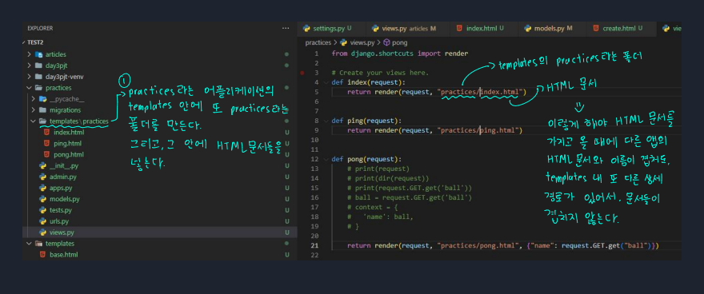
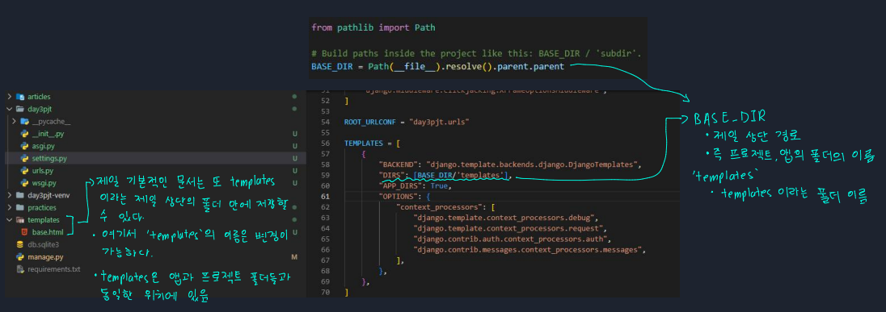
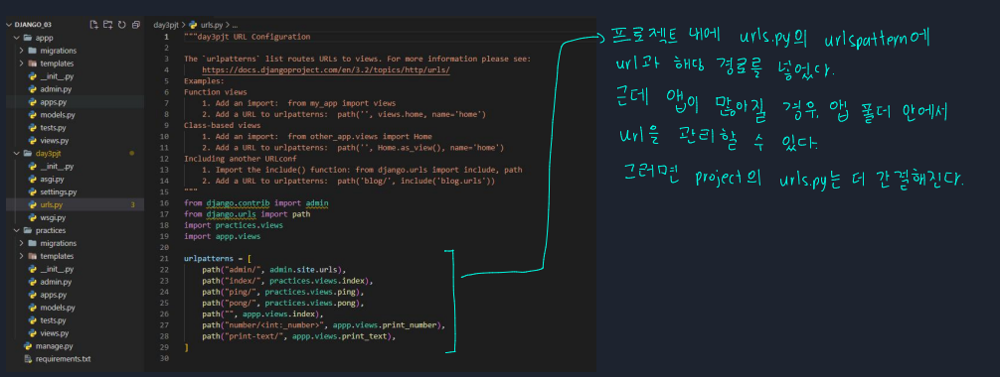
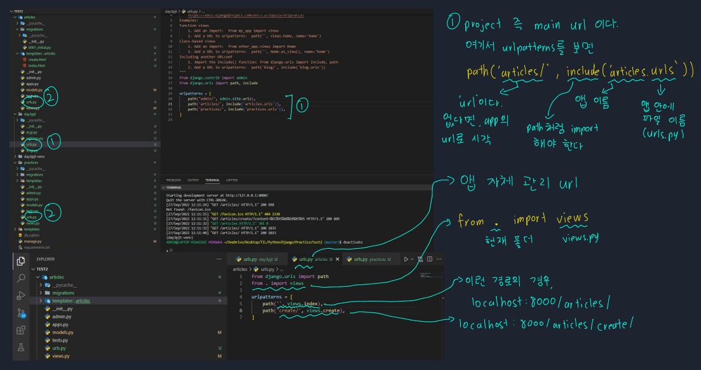
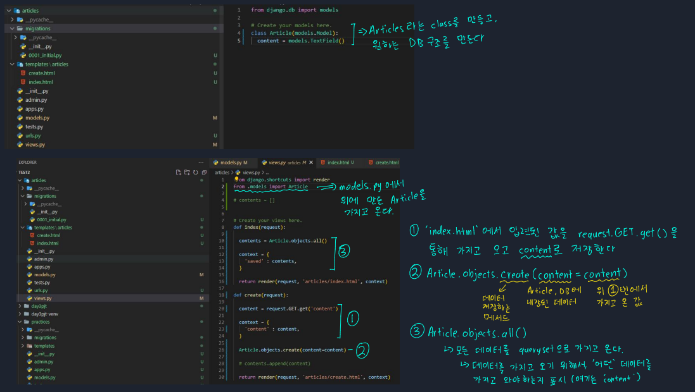

# 📋Django 4

#### Category

[Template Inheritance](#%EF%B8%8F-Template-Inheritance)

[Django URL](#%EF%B8%8F-Django-url)

[DB 이용](#%EF%B8%8F-DB-이용) - CRUD (Create)

## 📌📌 Django 란?

- **URL로 요청이 오면, 내가 원하는 문서로 응답하는 것**

- **웹 서비스, 파이썬 기반 웹 프레임워크**

## ✔️ Template Inheritance

> 다른 앱인데, HTML 문서의 이름이 같을 경우, 프로젝트의 settings.py 의 INSTATLLED_APP에서 위에 있는 앱의 HTML 문서를 먼저 확인을 하고, 그 HTML 문서만 보이게 된다
>
> 1. 그래서 앱의 Templates 폴더에, 또 하나의 폴더를 생성을 해서 Template을 관리한다
> 2. 제일 상단, 즉 기본 template은 BASE_DIR로 해결 할 수 있따

### Template 내 폴더

> 프로젝트의 어플리케이션 내에 `templates` 폴더 안에 또 HTML문서를 저장할 폴더를 추가로 만들어 준다
>
> 그러면 templates 내에 또 다른 상세 경로가 생겨서, 다른 동일한 이름의 HTML 문서들과 겹치지 않는다

### 최상단의 기본 Template

> 기본으로 사용하는 HTML 문서는 다른 폴더에 저장할 수 있다
>
> 일단 폴더 최상단에 폴더를 만든다 (밑에 같은 경우 templates)
>
> 그리고 settings.py에 TEMPLATES에서 'DIRS' : BASE_DIR/'templates' 을 저장한다
>
> 여기서 BASE_DIR은 프로젝트의 최상단 폴더이다

## ✔️ Django URL

> 기본적으로 모든 url을 프로젝트의 `urls.py`에 저장을 했다
>
> 하지만 어플리케이션이 많아지면, 모든 url을 `urls.py`에 저장하면, 많이 복잡해진다
>
> 그래서 main은 프로젝트의 `urls.py`로 세팅하고, sub는 각 어플리케이션에 `urls.py`를 만들어 관리를 한다

### 원래 urls.py

> 모든 `url`과 해당 경로를 저장했을 때에 많이 복잡해질 수 있다

### 정리된 urls.py

> `urls.py`를 어플리케이션 별로 관리
>
> main `urls.py` , 경로에 `include`를 넣는다
>
> - 그리고 `include` 안에는 어플리케이션의 이름과, 파일 이름을 넣는다 (여기서는 어플리케이션 안에 있는 `urls.py`로 들어가야 한다)
> - 예) `path('articles/', include('articles.urls'))`
>   - `'articles/'` 는 url
>   - `articles.urls` 에 `articles`은 어플리케이션의 이름, `urls`는 `urls.py`를 줄인 파일의 이름
>
> sub `urls.py`
>
> - path를 import 해주고, views를 import해준다
>   - 여기서 views는 `from . import views`로 가지고 온다.
>   - `.` 인 이유는 현재 폴더에서 가지고 와야하기 때문이다

## ✔️ DB 이용

> `models.py`에 DB 구조를 만든다
>
> 그리고 ORM을 통해 DB에 데이터를 넣고 (create), 데이터를 가지고 올 수 있다 (object.all)

