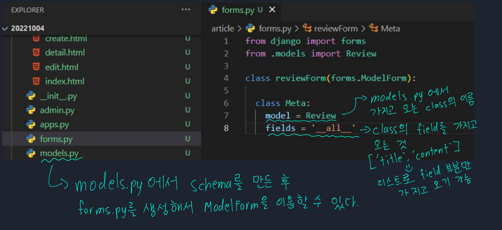
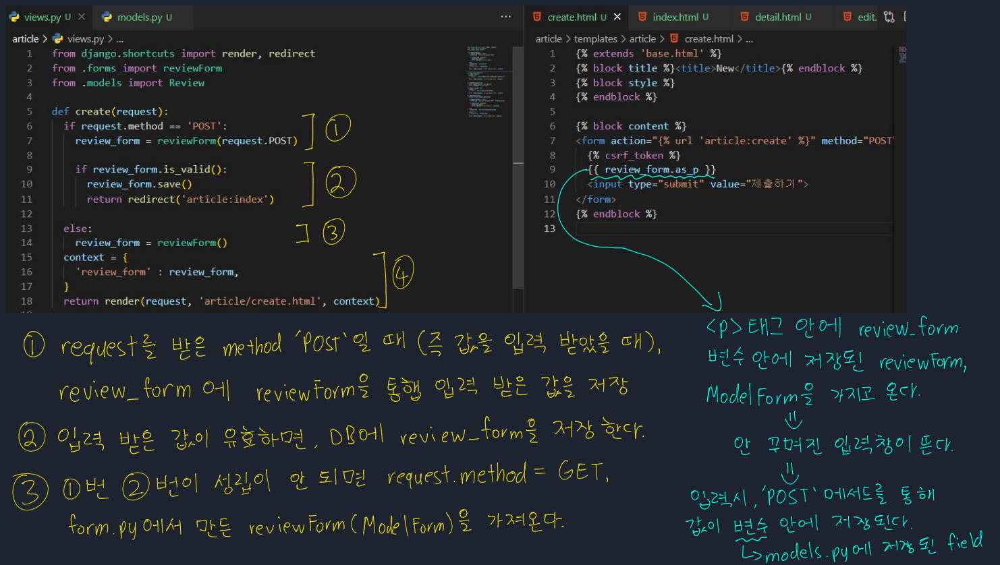
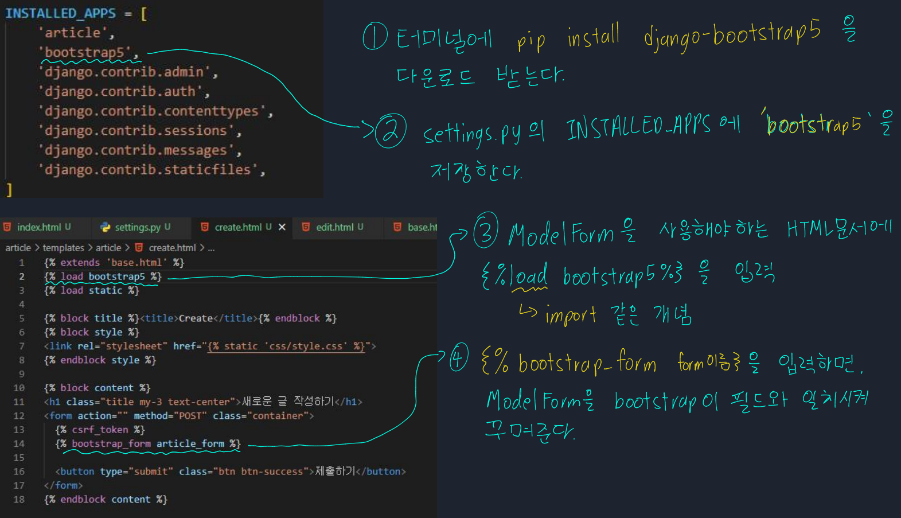
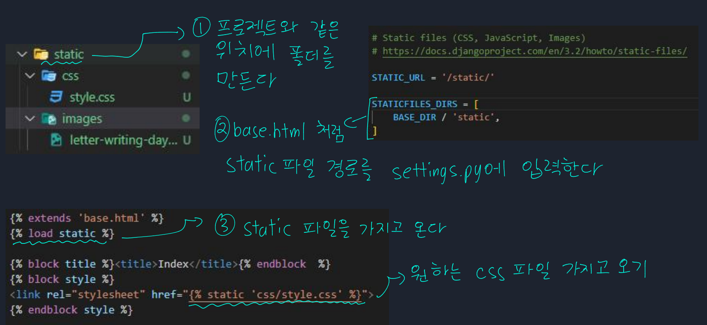

# 📋Django 7, 8

#### Category

[Web FrameWork](#%EF%B8%8F-Web-framework)

[ModelForm](#%EF%B8%8F-ModelForm)

- [Class 상속](#class-상속)

[Bootstrap](#%EF%B8%8F-bootstrap)

[Static Files](#%EF%B8%8F-static-file)

## ✔️ Web FrameWork

> 1. URL 요청을 받아 (urls.py)
>
> 2. 요청을 처리하고 (views.py)
>
> 3. 응답을 한다

### 게시판 만들기 예시

|      | 기능                               | URL                                             | views.py          |
| ---- | ---------------------------------- | ----------------------------------------------- | ----------------- |
| 생성 | HTML form \| DB 제작과정           | `/articles/new/` | `/articles/create/`          | `new` | `create`  |
| 조회 | 글을 누르면 DB 값 조회             | `/articles/<pk>/`                               | `detail`          |
| 삭제 | 버튼을 누르면 DB 값 삭제           | `/articles/<pk>/delete/`                        | `delete`          |
| 수정 | HTML form + 기본값 \| DB 저장 과정 | `/articles/<pk>/edit` | `/articles/<pk>/update` | `edit` | `update` |

- `<pk>` : DB 안에 있는 특정한 데이터를 가지고 오기 위해서
- 클라이언트는 URL 요청 (HTTP 요청 메세지)
  - path / methods / header / protocol

-------------------------------------

## ✔️ ModelForm

> 이미 models.py 에 저장한 `field`들을 그대로 HTML 문서에 사용하기 위해 이용한다.
>
> - 이렇게 하면, HTML 문서의 `<form>` 태그 사이에 입력값들을 다시 쓸 필요가 없다
>
> models.py 에 정의된 field에 맟춰
>
> - UI를 그려주고 / 유효성을 검사해주고 / DB에 저장시켜준다

------------------------------------------

- #### ModelForm에 대해서

  - model과 fields를 정의하는 것이 제일 중요한 설정이다
    - model에 클래스를 정의하면, 클래스 변수에 해당하는 것이 필드

#### Class 상속

- 부모 클래스의 기존 기능 (속성 or 메서드)에 새로운 기능을 덧붙이고 싶을 때에
- 예)
  - AritcleForm 또는 UserCreationForm에 ModelForm의 기능을 상속 받는다
  - 그리고 ModelForm의 기능 (예) 유효성 검사)을 살리면서, ArticleForm과 UserCreationForm에 각자 맞는 model과 fields를 설정한다

#### CREATE

> UI 제공 **(GET)**   |   DB 저장 **(POST)**

#### READ

> DB에서 특정 데이터를 가져와서 조회

#### UPDATE

> UI 제공 **(GET)**   |   DB 저장 **(POST)**

#### DELETE

> DB에서 특정 데이터를 가져와서 삭제

------------------------------------------------------------------------------------

#### POST

- 데이터를 저장하거나 기록하는 행위
- 예) 평점 기록

#### GET

- 정보를 조회할 때 사용

### ModelForm 생성하기

> forms.py를 생성하고, 그 안에다 새로운 class를 만든다
>
> class 안에 model (models.py에서 가지고 오는 class 이름)과 해당 모델의 field를 설정한다

### Create

> create이라는 함수 안에 입력창과 입력값 저장을 한번에 할 수 있다
>
> 먼저 create/ 이라는 url 에 들어오면 메서드가 `GET`이기 때문에 바로 13번 줄로 가게 된다.
>
> - 13번 줄에서 reviewForm 이라는 ModelForm을 review_form에 저장을 한다
> - 그리고 그 review_form을 HTML 문서에 보낸다
> - HTML 문서에 `{{ review_form.as_p }}` 를 통해 입력창이 보이게 된다
>
> 해당 입력창에 유저가 정보를 입력하면 메서드가 `POST`로 바뀌고 7번줄로 넘어간다
>
> - 7번줄에서 유저가 입력한 데이터를 `request.POST`를 통해 가지고 온다
> - 가지고 온 데이터를, review_form 변수에 저장을 한다
>
> 해당 변수안에 입력한 데이터가 유효하면 10번 줄로간다
>
> - review_form을 저장하고, index 페이지로 넘어간다
>
> 유효하지 않으면, 다시 18번줄로 가게 되고, 에러 메세지가 나온다

### Update

> create와 똑같다
>
> 다만, Update같은 경우 **특정** 데이터를 수정을 한다
>
> 그래서 `instance=review` 를 통해 수정을 할 특정 데이터를 가지고 올 수 있다
>
> - 여기서 review는 44번 줄에, Review 데이터베이스의 pk값을 일치한 데이터다

- `<form action="">` : 동일한 URL에 있는 것이라서 action은 비워놔도 된다
  - `views.py` 에 return 값이 `/edit/html`이다

## ✔️ Bootstrap

> ModelForm 같은 경우, Django-Bootstrap을 통해서 꾸며준다
>
> Django-Bootstrap을 사용하면, 알아서 ModelForm의 field별로 Bootstrap 디자인으로 꾸며준다

1. 터미널에 `$ pip install django-bootstrap5` 을 다운로드 받는다
2. settings.py의 INSTALLED_APPS에 `'bootstrap5'`를 입력/저장한다
3. ModelForm을 사용해야 하는 HTML 문서에 `을 입력한다
   - 여기서 `load` 는 ` import` 같은 개념이다
4. ``을 입력하면, ModelForm을 bootstrap이 필드와 일치시켜 꾸며준다

_______________________

## ✔️ Static File

> CSS, Javascript, images 등을 `static file`에 templates처럼 저장해서 사용한다

