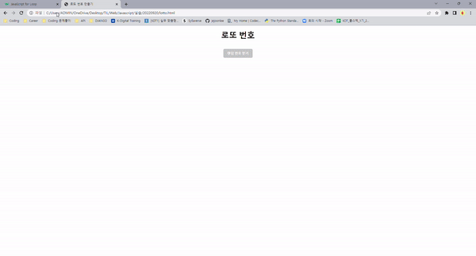

# 📋Web JavaScript

#### Category

[로또 생성기](#%EF%B8%8F-로또 생성기)


## ✔️ 로또 생성기



- 로또 생성기를 만들었다. HTML과 CSS는 생략하고 JavaScript 위주로 내용 정리를 하겠다

- 일단 `<script>`에 cdn는 `lodash`이란 곳에서 가지고 왔다.
  - 주로 로또 번호 안에, 번호들을 랜덤하게 가지고 오기 위함이었다

```javascript
    const lottoBtn = document.querySelector('#lotto-button')
    let clickNum = 0
    // 로또 버튼을 눌렀을때 일어나는 함수
    // 5번까지 가능
    lottoBtn.addEventListener('click', function () {
      if (clickNum !== 5) {
        clickNum ++
        console.log(clickNum)
        return lotto()
      } else {
        document.querySelector('.result').reset
        alert('새로운 로또 번호를 보고싶으시면 새로고침을 누르세요')
      }
    })
```

- 먼저 `로또 버튼` 을 눌렀을때의 `addEventListener`을 설정했다
  - if문을 통해 5번을 클릭하게 되면 `alert`가 뜨게 되고, 더 이상 버튼을 눌러도 새로운 로또 번호가 나오지 않게 설정을 했다
  - 그 전에는 `return lotto()`를 했는데 `lotto()`는 내가 따로 함수로 만들어 놓았다

```javascript
    function lotto() {
      
      // 컨테이너를 만들기
      // 버튼을 누르면 'div'라는 HTML 태그가 생성이되고 (createElement)
      // classList.add를 통해서 'div'의 'class'를 정의한다
      const ballContainer = document.createElement('div')
      ballContainer.classList.add('ball-container')

      // 숫자 생성
      // lodash를 활용했다 (위에 CDN으로 있음)
      const number = _.sampleSize(_.range(1,46), 6)
      console.log(number)


      // for문으로 버튼을 누를때마다 6개의 공이 생기게 하고
      // i는 각 숫자 생성했을 때에 node의 인덱스가 되게 한다
      for (let i = 0; i < 6; i++) {
        
        // 공 만들기
        const ball = document.createElement('div')
        ball.classList.add('ball')
        // 컨테이너가 만들어질 때, 'ball'이 자식 요소로 뜨게 한다
        ballContainer.appendChild(ball)

        //  공 안에 숫자 넣기
        ball.innerText = number[i]

        switch (Math.floor(number[i] / 10)) {
          case 0:
            ball.style.backgroundColor = '#d9d90d';
            break
          case 1:
            ball.style.backgroundColor = '#2570e8';
            break
          case 2:
            ball.style.backgroundColor = '#e03636';
          break
          case 3:
            ball.style.backgroundColor = '#707070';
          break
          case 4:
            ball.style.backgroundColor = '#1ed106';
          break
        }
      }

      // 위에 컨테이너와 공은 버튼을 클릭할때 나타나는 요소다
      // HTML에 있는 'result'와 연결을 하여, 버튼을 클릭 했을 때,
      // 화면에 출력이 되도록 설정을 한다
      const result = document.querySelector('.result')
      result.appendChild(ballContainer)
      //-------------------------------------------------------------
    }
```

- 위는 `lotto()` 함수이다
- 먼저 로또 버튼을 누르면 로또 공들을 넣을 `container`를 만들었다

```javascript
      const ballContainer = document.createElement('div')
      ballContainer.classList.add('ball-container')
```

- 그리고 아까 가져온 lodash를 활용해서 랜덤 숫자들을 가지고 왔다

```javascript
      const number = _.sampleSize(_.range(1,46), 6)
      // 여기서 1에서 46사이에 있는 숫자들 중 6개를 아무거나 가지고 오는 것
      console.log(number)
```

- 그리고 for문을 통해 `container`안에 넣을 공과, 공 안에 위에서 가지고 온 6개의 숫자 배열들을 넣었다

```javascript
      for (let i = 0; i < 6; i++) {
        const ball = document.createElement('div')
        ball.classList.add('ball')
        ballContainer.appendChild(ball)

        ball.innerText = number[i]
```

> 여기서 `i`는 숫자 배열의 인덱스이다

- 이 for문 안에 `switch`문을 넣어서 해당 공들의 색깔을 조건에 따라 변경을 하였다
- 마지막으로 이 `lotto()` 함수가 HTML에 보이게 하기 위해서는, HTML에 있는 요소와 연결을 해줘야 한다

```javascript
      const result = document.querySelector('.result')
      result.appendChild(ballContainer)
// .result는 이미 HTML에 있는 값이다
// 로또 공이 담긴 `ballContainer`를 '.result'에 연결을 시켜준다
```

