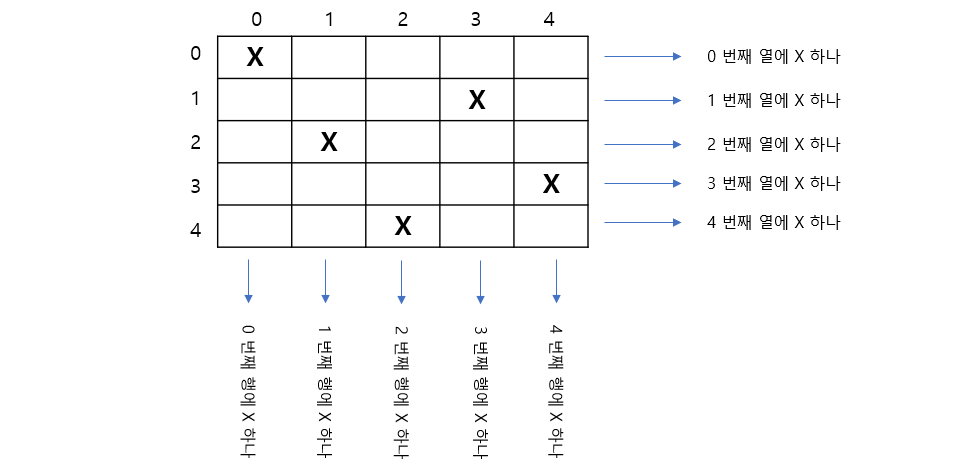
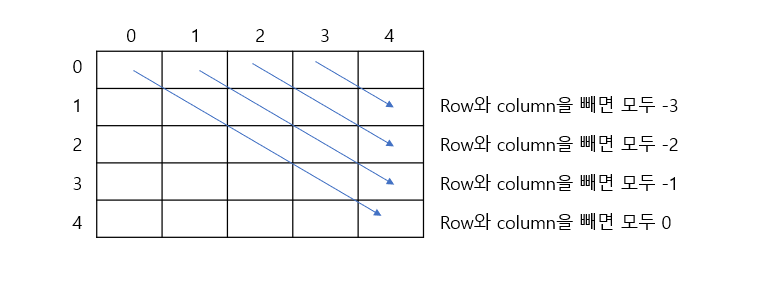

# 🧑‍💻 [Python] 백준 9663 N-Queen

### Gold 4 - Backtracking


#### Queen은 위, 아래, 오른쪽, 왼쪽, 대각선, 8 방면 모두 공격을 할 수 있다

#### N이 주어지고, 체스판 사이즈는 N x N 이고, N 개의 Queen을 넣었을 때 서로 공격할 수 없는 때의 경우의 수를 찾는 것


#### 1차적으로 자세히 보면, 각 행과 열마다, Queen은 하나씩 배치할 수 있다

- 이 뜻은 굳이 체스판 자체를 안 만들어도 된다
- **board = [0, 3, 1, 4, 2]**
  - 아래 사진을 표현한 리스트 (board의 인덱스가 열/row, board의 값이 행/column)
  - **board 안에 있는 값들은 모두 달라야 한다**


| row (board의 인덱스) | column (board의 값) |
| :------------------: | :-----------------: |
|          0           |          0          |
|          1           |          3          |
|          2           |          1          |
|          3           |          4          |
|          4           |          2          |




#### 그 다음에는 각 Queen들끼리 공격할 수 있는 대각선 경로가 겹치지 않도록 한다

- Queen이 같은 대각선 상에 있을 경우, row와 column을 빼면, 같은 값이 나온다
- 즉 Queen이 같은 대각선 상에 위치하지 않도록, row와 column을 뺐을 때에, 다른 값이 나오도록 해야 한다




## 코드


```python
N = int(input())

board = [0] * N
result = 0

def is_possible(c):
    
    for column in range(c):
        if board[c] == board[column] or abs(c - column) == abs(board[c] - board[column]):
            return False
    
    return True


def backtracking(start):

    global result

    if start == N:
        result += 1
        print(board)
        return
    
    for column in range(N):

        board[start] = column

        if is_possible(start):
            backtracking(start + 1)    


backtracking(0)

print(result)
```
