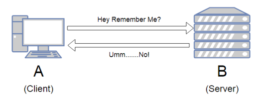

# 21. 로그인 [세션 기반 인증 방식, 토큰 기반 인증 방식]

*CS 노트*

## 세션 기반 인증 방식

> #### HTTP의 특징 중 하나는 stateless 한 것이다
>
> - 위의 그림처럼 한번 요청하고 응답한 사항은, 추후에 다시 요청을 받을 때, 서버에서 기억을 못 한다

#### 즉, 원래는 한번 로그인 했다고 로그인 상태를 유지 시켜주지 않는다

#### 그래서 유저들의 UX을 위해서 사용자들의 정보를 기억하기 위해서 세션을 유지해야 한다

- **세션 (Session)** : 사용자가 인증을 할 때, 서버가 정보를 저장하는 것을 세션이라고 한다. 

.png)

- 클라이언트가 로그인을 요청하면, 서버에서 쿠키에 세션을 생성하고 클라이언트에 응답을 해준다
  - **set-cookie : SESSIONID = XXXXXXXXXXXXXXXXXXXXXXXXXXXXXXXXXXXXXXXXXXX**
- 이후에 클라이언트에서 요청을 보낼 때 마다, 생성한 세션 ID를 헤더로 넣어 데이터를 요청한다
  - **cookie : SESSIONID = XXXXXXXXXXXXXXXXXXXXXXXXXXXXXXXXXXXXXXXXXXX**
  - 즉 요청을 보낼 때 마다, 서버에서 인증된 세션을 확인할 수 있다
  - 세션 확인을 통해, 서버에서 로그인을 계속 유지 시켜줄 수 있다

#### 세션 ID는 DB 또는 웹 서버에 저장이 된다

- 사용자가 늘어나게 되면, 메모리가 늘어나서 서버에 과부하가 될 수 있다

## 토큰 기반 인증 방식

