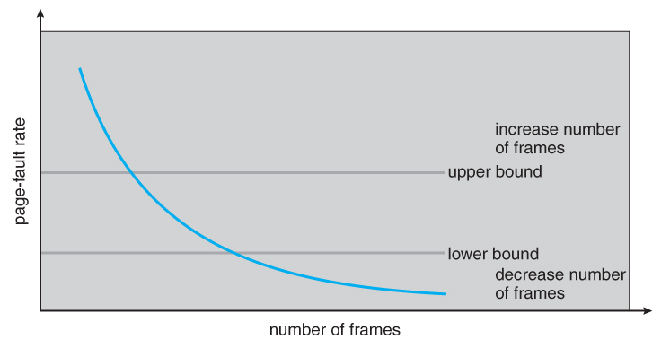

# 28. 운영체제 [가상메모리, 스와핑, 페이지폴트, 스레싱]

*CS 노트*

## 가상 메모리

> #### 메모리 관리 기법의 하나로 기계에 실제 이용 가능한 기억 자원을 이상적으로 추상화하여 사용자들에게 매우 큰 (주) 메모리로 보이게 만드는 것이다
>
> #### 주로 멀티테스킹 운영 체제에서 사용되고, 주 기억 장치 (RAM) 보다 큰 메모리 영역을 제공하는 방법으로도 사용된다

#### 가상으로 가상 주소 또는 논리 주소가 주어지고, 실제 메모리 상에는 물리 주소 또는 실 주소가 있다

- 여기서 가상 주소는 MMU(Memory Management Unit), 메모리 관리 장치를 통해 실제 주소로 변환된다
- TLB, '페이지 테이블'을 기반으로 가상 주소에서 물리 주소로 변환이 된다
  - TLB는 메모리와 CPU 사이에 있는 캐시다

### 스와핑

> 가상 메모리에는 존재하지만, 실제 RAM에 존재하지 않은 데이터를 접근하면 페이지 폴트가 발생한다
>
> 이때 RAM에 사용하지 않는 영역과, 필요한 영역을 하드 디스크와 바꾸는 것을 스와핑이라고 한다
>
> - 이렇게 스와핑이 일어나면, 페이지 폴트가 없는 것처럼 진행될 수 있

**페이지** : 가상 메모리를 사용하는 최소 크기 단위

**프레임** : 실제 메모리를 사용하는 최소 크기 단위

### 페이지 폴트

> 스와핑에서 설명했던 것과 같이, 가상 메모리에는 존재하는 데이터인데, RAM에는 없는 데이터가 있을 때 발생하는 것이다

1. 페이지가 접근이 허용되는지 안 되는지 확인을 한다
2. 접근이 허용이 안 될 경우, 트랩을 발동시키면서, 모든 프로세스가 중단된다
3. 시스템 내에 프레임을 프레임 리스트에서 찾는다
4. 물리 메모리에 없었던 페이지를 넣는다
5. 페이지 테이블에 없었던 페이지를 넣어 최신화 한다
6. 다시 작동을 시킨다

### 스레싱 (Thrashing)

> 페이지 폴트가 너무 많이 일어날 때를 의미한다
>
> 페이지 폴트가 너무 많을 경우, 스와핑이 증가한다는 것인데, 이때 컴퓨터의 성능 저하로 이어진다

#### 스와핑을 할 때에는 CPU 이용률이 낮아지고, 운영체제에서는 CPU가 일을 안 하는 줄 알고, 일을 계속 주게 된다

- 이게 계속 반복이 되면서 스레싱이 일어난다

#### 메모리를 늘리거나, HDD에서 SDD로 넘어가며 스레싱을 해결할 수 있따

#### 작업 세트

- 과거에 사용했던 이력을 통해 페이지 집합을 만들어 미리 메모리에 로드를 하는 것이다
- 예전에 사용했던 페이지 집합을 가지고 미리 메모리에 로드를 할 경우, 탐색이 줄어들고, 스와핑도 줄일 수 있다

#### PFF (Page Fault Frequency)

