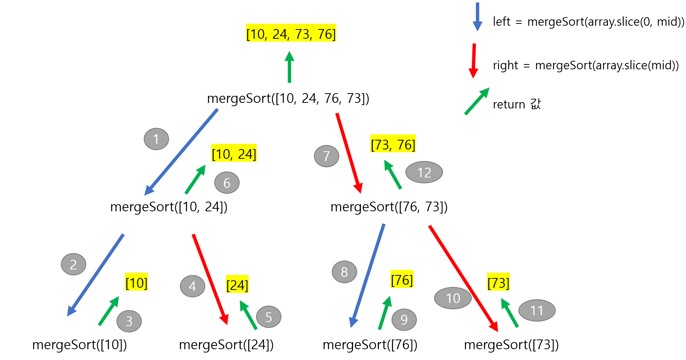

# Udemy - Javascript - Merge Sort


## 정렬이란?

> #### 데이터가 있으면, 데이터를 숫자 또는 단어별로 오름차순 또는 내림차순으로 나열하는 것이다

- 정렬을 하는 방법은 다양하다.
- 정렬하는 방법마다, 정렬을 하는 시간은 다르다


#### 버블, 선택, 삽입 정렬들은 숫자가 계속 늘어날 수록, 속도가 느려진다

#### 반대로 합병 정렬, 퀵 정렬, 지수 정렬은 위의 3개보다 더 빠르다


## 합병 정렬

#### 


### 두 배열 합병하기

```py
function mergeSort(array1, array2) {
    let i = 0
    let j = 0
    let newArray = []

    while (i < array1.length && j < array2.length) {
        if (array1[i] < array2[j]) {
            newArray.push(array1[i])
            i ++
        } else {
            newArray.push(array2[j])
            j ++
        }
    }
    
    while (i < array1.length) {
        newArray.push(array1[i])
        i ++
    }
    
    while (j < array2.length) {
        newArray.push(array2[j])
        j ++
    }


    return newArray
}

mergeSort([1, 10, 50], [2, 14, 99 , 100])
```

- 첫 while문에서는 두 개의 배열의 숫자들을 비교하면서 새로운 배열에 정렬을 하며 숫자들을 넣는다
- 나머지 두 배열들은, `array1` 또는 `array2`에 숫자가 남아있을 수 있어, 남는 숫자들을 새로운 배열에 넣어 준다
  - 이미 두 배열은 정렬이 되어 있는 상황이라, 남아 있는 숫자들은 새로운 배열의 숫자들 보다 큰 숫자들이다


## 합병 정렬 코드

```javascript
function merge(array1, array2) {
    let i = 0
    let j = 0
    let newArray = []

    while (i < array1.length && j < array2.length) {
        if (array1[i] < array2[j]) {
            newArray.push(array1[i])
            i ++
        } else {
            newArray.push(array2[j])
            j ++
        }
    }
    
    while (i < array1.length) {
        newArray.push(array1[i])
        i ++
    }
    
    while (j < array2.length) {
        newArray.push(array2[j])
        j ++
    }


    return newArray
}


function mergeSort(array) {
    if (array.length <= 1) return array;
    let mid = Math.floor(array.length/2)
    let left = mergeSort(array.slice(0, mid))
    let right = mergeSort(array.slice(mid))
    
    return merge(left, right)
}
```

- `mergeSort(array)`, 재귀 함수를 통해서 합병 정렬을 한다
  - `mid` 는 중간 지점을 구하고, 그 중간 지점 기준으로 오른쪽과 왼쪽을 `.slice`를 반반 한다
  - 그것을 왼쪽 기준으로 계속해서 배열의 길이가 1일 때까지 계속한다. 
  - 그 다음엔 오른쪽도 1일 때까지 mergeSort를 해주고, 1이 나오면 `merge()`를 한다
  - 이것을 계속 반복하다 보면, 모든 수가 정렬이 된다




- 3, 5, 9, 11 은 `if (array.length <= 1) return array` 이다
  - 즉 배열에 원소가 하나 밖에 없어서, 그냥 그 배열을 반환 하는 것이다
- 3번이랑 5번이 배열을 하나씩 반환한다
  - 이렇게 되면 `merge()`에서 argument로 2개의 배열 (left, right)을 넣어서 합병을 할 수 있게 된다
