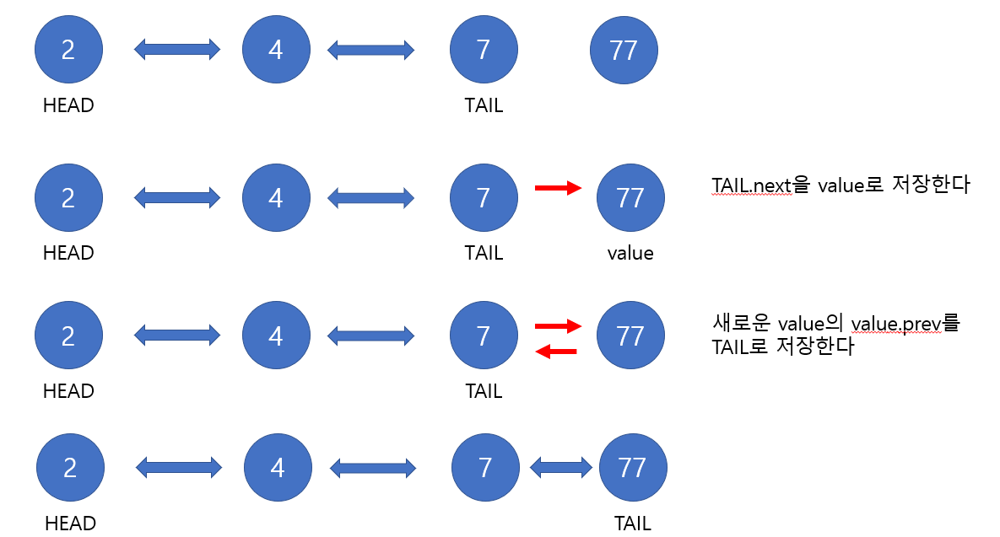
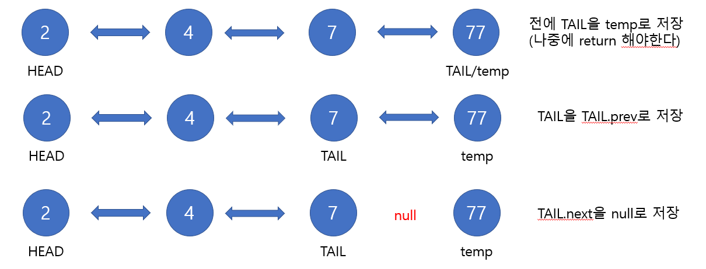
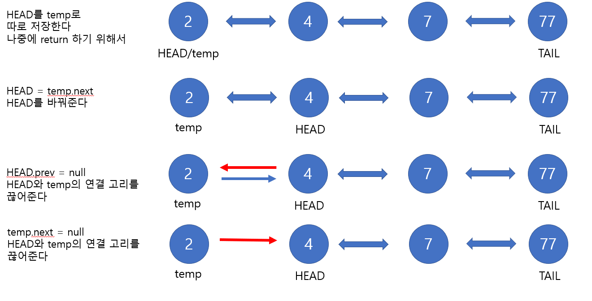

# Udemy - Javascript - Data Structure

#### Doubly Linked Lists (이중 연결 리스트)


## 자료구조

> #### 자료 구조는 데이터에 적용될 수 있는 값들 및 기능 혹은 작업들 사이의 관계를 포함한다

예를 들어 배열을 생각한다

- 배열 안에는 값들 사이에 관계가 있다 (정렬을 하거나, 값을 추가할 수 있거나 없앨 수 있다)


자료 구조에는 많은 종류가 있고, 각자 쓰임세가 다르다


## 이중 연결 리스트

#### 이중 연결 리스트는, 다음 노드를 가리키는 간선이 2개이다

- 즉 앞에 노드와 뒤의 노드를 가리킨다

#### 단점은 매모리를 단일 연결 리스트보다 더 많이 잡아 먹는


```javascript
class Node {
    constructor(value){
        this.value = value;
        this.next = null;
        this.prev = null;
    }
}

class DoublyLinkedList {
    constructor() {
        this.head = null;
        this.tail = null;
        this.length = 0
    }
    
    push(value) {
       var newNode = new Node(value)
       
       if (this.length === 0) {
           this.head = newNode;
           this.tail = newNode;
       } else {
           this.tail.next = newNode;
           newNode.prev = this.tail
           this.tail = newNode
       }
       
       this.length += 1
       return this
    }
    
    pop() {
        if (this.length === 0) return undefined;
        
        var tempTail = this.tail
        if (this.length === 1) {
            this.head = null;
            this.tail = null;
        } else {
            this.tail = tempTail.prev;
        	this.tail.next = null;
        	tempTail.prev = null;
        }
        this.length -= 1;

        return tempTail
    }
    
    shift() {
        if (this.length === 0) return undefined;
        
        var tempHead = this.head
        if (this.length === 1) {
            this.head = null;
            this.tail = null;
        } else {
            this.head  = tempHead.next;
            this.head.prev = null;
            tempHead.next = null;
        }
        this.length -= 1;
        
        return tempHead
    }
    
    unshift(value) {
        var newNode = new Node(value)
        
        if (this.length === 0) {
            this.head = newNode;
            this.tail = newNode;
        } else {
            newNode.next = this.head
            this.head.prev = newNode
            this.head = newNode
        }
        this.length += 1
        
        return this
    }
    
    get(index) {
        if (index < 0 || index >= this.length) return null;
        if (index <= this.length / 2) {
            var count = 0
            var current = this.head;
            while (count != index) {
                current = current.next;
                count ++;
            }
        } else {
            var count = this.length - 1
            var current = this.tail;
            while (count != index) {
                current = current.prev;
                count --;
            }
        }
        
        return current;
    }
    
}
```


#### `push(value)`




#### `pop()`



- 마지막에 `temp.prev = null`로 해서 중간 간선을 아예 없앤다


#### `shift()` : 제일 앞에 있는 값 빼기




#### `unshift(value)` : 제일 앞에 있는 값 넣기


#### `get(index)` : 인덱스의 값을 출력해준다

- `this.length`기준, index가 `this.length`의 반 이하이면, head부터 시작하고, 그 위면 tail부터 시작해도 된다
