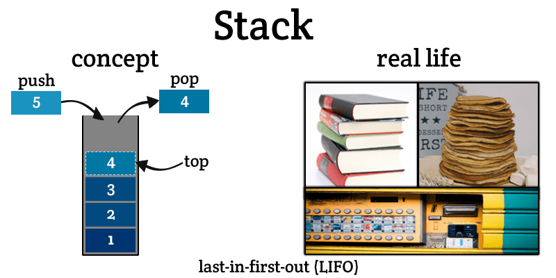

# Udemy - Javascript - Stack, Queue


## **Stack & Queue**

> #### 데이터 구조의 모음이다
>
> #### 좀 더 압축적인 데이터 구조이다
>
> #### 데이터를 추가 또는 빼낸다


## Stack (스택)

#### LIFO (Last In First Out)

- 제일 마지막으로 스택에 추가된 것이, 제일 먼저 나간다



#### 예를 들어, 재귀에서, 콜스택 (Call Stack)처럼, 제일 마지막에 추가된 요소를 먼저 빼낸다


### 배열로 스택 구현하기

```javascript
// 스택 만들기
var stack = []

stack.push('google')
stack.push('instagram')
stack.push('youtube')

stack.pop()
// youtube
stack.pop()
// instagram
stack.pop()
// google
```

- 스택은 `stack`에 google ▶️ instagram ▶️ youtube 순으로 들어가고, youtube ▶️ instagram ▶️ google 순으로 빠진다
- `.unshift` 와 `shift`를 사용하여 스택을 구현할 수 있지만, 스택 안에 데이터가 많아지면, 느려진다
  - 다른 값들의 인덱스들을 새로 만들어야 한다


### 연결 리스트로 스택 구현하기

> 단일 연결 리스트

```javascript
class Node {
    constructor (value) {
        this.value = value;
        this.next = null;
    }
}

class Stack {
    constructor() {
        this.first = null;
        this.last = null;
        this.size = 0;
    }
 	
    push(value) {
        var newNode = new Node(value);
        if (!this.first) {
            this.first = newNode;
            this.last = newNode
        } else {
            var temp = this.first;
            this.first = newNode
            newNode.next = temp
        }
        this.size ++
        return this.size
    }
    
    pop() {
        if (!this.first) return null;
        var temp = this.first;
        if (this.first === this.last) {
            this.last = null;
        }
        
        this.first = this.first.next;
        this.size --;
        return this.size;
    }
}
```

- 원래 `.shift()`와 `.unshift(value)`와 같다. 단 이름만 `.push(value)`, `pop()`이다
- 리스트 앞에서 부터 채워주고, `pop()`을 할 때에, 앞에서부터 빼준다
- **빅오를 생각하면 `pop()`, `push(value)`가 더 빠르다**


> 이중 연결 리스트

```javascript
class Node {
    constructor (value) {
        this.value = value;
        this.next = null;
        this.prev = null;
    }
}

class Stack {
    constructor() {
        this.first = null;
        this.last = null;
        this.size = 0;
    }
    
    push(value) {
        var newNode = new Node(value);
        
        if (this.size === 0) {
            this.first = value;
            this.last = value;
        } else {
            this.last.next = newNode;
            newNode.prev = this.last;
            this.last = newNode;
        }
        this.size ++;
        return this.size
    }
    
    pop() {
        if (this.size === 0) return null;
        var removeNode = this.last;
        if (this.first === this.last) {
            this.last = null;
        }
        
        this.last = removeNode.prev;
        removeNode.prev = null;
        this.last.next = null;
        this.size --;
        return removeNode;
    }
    
}
```


## Queue (큐)

#### FIFO (First In First Out)

- 제일 처음 큐에 추가된 요소가, 제일 먼저 나간다


### 배열로 큐 구현하기

```javascript
var queue = []

queue.push("First")
queue.push("Second")
queue.push("Third")
queue.push("Fourth")
// queue = ["First", "Second", "Third", "Fourth"]

queue.shift()
// "First"
queue.shift()
// "Second"
```

- 반대로 `.unshift(value)`를 통해서 앞에서 부터 배열을 채우고, `.pop()`을 통해서 제일 먼저 들어왔던 요소를 빼낼 수 있다
- `push(value)` : O(1) / `shift()` : O(N)
- `pop()` : O(1) / `unshift()` : O(N)
- **결국 queue로는 O(N)이다**, 즉 최선이 아니라는 것


### 리스트로 연결로 큐 구현하기

> 단일 연결 리스트

```javascript
class Node {
    constructor(value){
        this.value = value;
        this.next = null;
    }
}

class Queue {
    constructor(){
		this.first = null;
        this.last = null;
        this.size = 0;
    }
    
    enqueue(value) {
        var newNode = new Node(value);
        if (!this.first) {
            this.first = newNode;
            this.last = newNode;
        } else {
            this.last.next = newNode;
            this.last = newNode;
        }
        this.size ++ ;
        return this.size;
    }
    
    dequeue() {
        if (!this.first) return null;
        var temp = this.first;
        if (this.first === this.last) {
            this.first = null;
            this.last = this.first
        } else {
            this.first = temp.next;
            temp.next = null;
        }
        this.size --;
        return temp
    }
}
```


> 이중 연결 리스트

```javascript
class Node {
    constructor(value){
        this.value = value;
        this.next = null;
        this.prev = null;
    }
}

class Queue {
    constructor(){
		this.first = null;
        this.last = null;
        this.size = 0;
    }
    
    enqueue(value) {
        var newNode = new Node(value);
        if (!this.first) {
            this.first = newNode;
            this.last = newNode;
        } else {
            this.last.next = newNode;
            newNode.prev = this.last;
            this.last = newNode;
        }
        this.size ++ ;
        return this.size;
    }
    
    dequeue() {
        if (!this.first) return null;
        var temp = this.first;
        if (this.first === this.last) {
            this.first.next = null;
            this.last.prev = null;
        } else {
            this.first = temp.next
            temp.next = null
            this.first.prev = null
        }
        this.size --;
        return temp
    }
}
```


