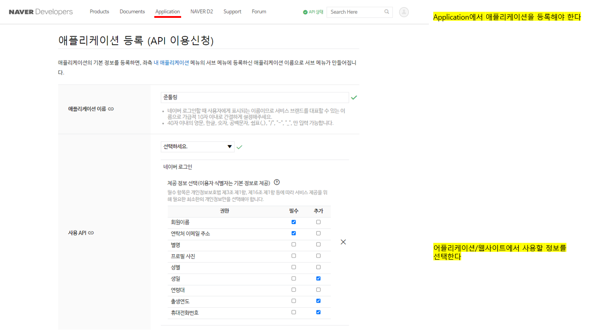

# Joontooling 프로젝트

> 업무 : 회원가입 모델링


## OAuth란?

> #### Open Authorization 은 비밀번호 없이, 제 3자 웹사이트에 있는 정보를 현재 사용하려고 하는 웹사이트가 사용할 수 있도록 허용하는 것이다


- 네이버는 나의 웹사이트한테 accessToken을 전달 하면서, 나의 웹 사이트에서 필요한 기능들만 부분적으로 허용한다
  - accessToken을 통해서 네이버에 접근해서 데이터를 읽고, 생성하고, 삭제하고, 수정할 수 있다
- 나의 웹사이트에서 네이버의 ID, Password를 직접적으로 사용하는 것이 아니라서 보안적인 측면에서 안전하다


### 역할

- **Resource Server (Naver)** : 사용하고자 하는 자원 (데이터)의 위치, 즉 Resource Server에 있다
  - 나의 웹사이트에서 네이버 안에 있는 자원을 사용하려고 한다
- **Resource Owner (User)** : 자원 (데이터)의 소유자
  - 네이버 안에 있는 자원의 소유자는, 유저, 즉 '나'다
- **Client (나의 웹사이트)** : 자원 (데이터)을 사용하고자 하는 웹 서비스 또는 어플리케이션이다
  - 네이버의 자원을 사용하려고 하는 나의 웹사이트다


## 네이버 OAuth 연동




- **Client ID** : 만들고자 하는 어플리케이션 / 웹 서비스의 식별자
- **Client Secret** : Client ID에 대한 비밀번호 (외부 노출을 하면 절대로 안 된다)
- **Callback URL** : 클라이언트가 Resource Server, 즉 다른 웹 사이트에게 요청을 보낼 수 있는 URL이다
  - 이 URL로 요청을 보내지 않으면, Resource Server는 요청을 무시한다
- 네이버에서 allauth를 사용하려면 callback url은 **http://localhost:8000/accounts/naver/login/callback/** 이다


## Django

> #### 장고에는 django-allauth가 있다
>
> - django-allauth에는 다양한 소셜로그인 처리를 해주는 장고 익스텐션이다


- **django-allauth 설치**

```
pip install django-allauth
```


- **settings.py 수정**
  - TEMPLATES의 'OPTIONS / context_processors'에 **'django.template.context_processors.request'**가 꼭 들어가야 한다
  - AUTHENTICATION_BACKENDS를 추가해준다
  - INSTALLED_APPS에 allauth 관련된 것들을 추가해준다
    - **'allauth.socialaccount.providers.naver'**, 네이버 소셜 로그인을 위한 코드
    - 그 외에, 아래에 INSTALLED_APPS에 기재된 것들은, 다 추가해야 한다
  - **AUTHENTICATION_BACKENDS** : 로그인 과정 처리를 누구한테 맡기는지 설정
    - **'django.contrib.auth.backends.ModelBackend'** : 웹 사이트 내 회원가입 한 로그인 방식
    - **'allauth.account.auth_backends.AuthenticationBackend'** : Allauth를 사용한 로그인 방식


```python
TEMPLATES = [
    {
        'BACKEND': 'django.template.backends.django.DjangoTemplates',
        'DIRS': [],
        'APP_DIRS': True,
        'OPTIONS': {
            'context_processors': [
                # Already defined Django-related contexts here

                # `allauth` needs this from django
                'django.template.context_processors.request',
            ],
        },
    },
]

INSTALLED_APPS = [
    'django.contrib.auth',
    'django.contrib.messages',
    'django.contrib.sites',
    'allauth',
    'allauth.account',
    'allauth.socialaccount',
    
    'allauth.socialaccount.providers.naver',
]

AUTHENTICATION_BACKENDS = [
    # Needed to login by username in Django admin, regardless of `allauth`
    'django.contrib.auth.backends.ModelBackend',

    # `allauth` specific authentication methods, such as login by e-mail
    'allauth.account.auth_backends.AuthenticationBackend',
]

SITE_ID = 1

LOGIN_REDIRECT_URL = '/products/'
```

- allauth.account : 소셜 로그인으로 로그인 한 사람들의 목록 관리
- allauth.socialaccount : 소셜 account 정보를 관리


- **config 파일의 urls.py에 아래를 추가한다**

```python
urlpatterns = [
    path('accounts/', include('allauth.urls')),
]
```


- **장고 Admin 들어가기**


