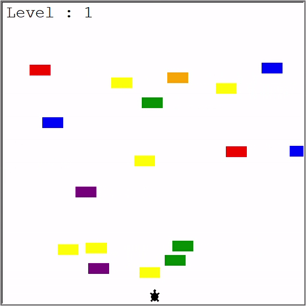

# Udemy : 파이썬 거북이 크로싱 프로젝트

> #### 거북이가 자동차들을 피해서 도로를 건너는 것
>
> #### 거북이는 위로만 갈 수 있다
>
> #### 자동차는 왼쪽으로만 움직인다
>
> - 자동차는 랜덤으로 생성
>
> #### 거북이가 도로를 건너면, 다음 레벨로 가고, 자동차 속도는 더 빨라진다




## 느낀 점

그 전에는 파이썬으로 숫자나 데이터만 보면서 실습을 하거나, 강의를 들었다. 그러다 보니, 생각하는 것도 배가 되고, 시각화가 잘 안 되어서 조금 힘들었다. 하지만, `turtle` 모듈을 이용하면서, 내 코드가 시각화가 되면서, 좀 더 재미있게 코딩을 할 수 있었던 것 같다.

특히, 전에는 `class`와 `function`이 잘 이해가 되지 않아서, 둘을 사용하는 것을 많이 자제를 했다. 아니면 장고를 할 때에는, 크게 생각을 안 하면서 사용을 했다. 하지만, 이번 강의를 통해서, 다시 복습을 하며 두 개의 개념을 더 이해를 했던 것 같다!


### main.py

> 이 게임의 로직 자체를 구현하는 파일이다
>
> `up` 키를 누를 때 거북이의 행동
>
> 거북이와 자동차가 부딛혔을 때 일어나는 일
>
> 거북이가 결승점에 도달했을 때, 더 어려운 레벨로 올라가는 것
>
> 점수판 등

```python
import time
from turtle import Screen
from player import Player
from car_manager import CarManager
from scoreboard import Scoreboard

screen = Screen()
screen.setup(width=600, height=600)
screen.tracer(0)

avator = Player()
car = CarManager()
scoreboard = Scoreboard()

screen.listen()

screen.onkey(avator.move ,"Up")

game_is_on = True
while game_is_on:
    time.sleep(0.1)
    screen.update()

    car.create_car()
    car.car_move()

    # 거북이가 도착 지점에 도착하면, 다시 시작 지점으로 돌아온다
    # 그리고 레벨이 올라간다
    if avator.ycor() > 280:
        car.level_up()
        avator.new_level()
        scoreboard.score_up()

    # 차에 부딛히면, 게임을 중단 시킨다
    for vehicle in car.all_cars:
        if avator.distance(vehicle) <= 20:
            game_is_on = False
            scoreboard.game_over()
            break

screen.exitonclick()
```


### player.py

> 유저가, 거북이를 조작하는 것을 구현한 파일이다
>
> 거북이는 위로 밖에 움직일 수 없어서 `y` 좌표만 신경을 쓰면 됬다

```python
from turtle import Turtle


STARTING_POSITION = (0, -280)
MOVE_DISTANCE = 10
FINISH_LINE_Y = 280


class Player(Turtle):

    def __init__(self):
        super().__init__()
        self.shape("turtle")
        self.penup()
        self.goto(STARTING_POSITION)
        self.setheading(90)

    def move(self):
        y_cor = self.ycor() + MOVE_DISTANCE 
        self.goto(0, y_cor)

    def new_level(self):
        self.goto(STARTING_POSITION)
```


### car_manager.py

> 자동차, 장애물이 만들어지는 것부터, 행동하는 것을 구현
>
> 오른쪽에서 왼쪽으로 움직이는 것. 즉 `x`좌표를 빼주면 된다
>
> 레벨이 올라가면, 자동차 속도가 더 빨라짐으로 `STARTING_MOVE_DISTANCE`의 속도를 어떻게 올릴지 고민하였다

```python
from turtle import Turtle
import random

COLORS = ["red", "orange", "yellow", "green", "blue", "purple"]
STARTING_MOVE_DISTANCE = 5
MOVE_INCREMENT = 10


class CarManager(Turtle):
    
    def __init__(self):
        self.all_cars = []
        self.car_speed = STARTING_MOVE_DISTANCE

    def create_car(self):
        random_chance = random.randint(1, 6)

        if random_chance == 1:
            new_car = Turtle("square")
            new_car.color(random.choice(COLORS))
            new_car.penup()
            new_car.shapesize(stretch_wid=1, stretch_len=2)
            random_y = random.randint(-240, 250)
            new_car.goto(300, random_y)
            
            self.all_cars.append(new_car)

    def car_move(self):
        for car in self.all_cars:
            car.backward(self.car_speed)

        
    def level_up(self):
        self.car_speed += 3
```


### scoreboard.py

> 점수판 구현

```python
from turtle import Turtle

FONT = ("Courier", 24, "normal")


class Scoreboard(Turtle):
    
    def __init__(self):
        super().__init__()
        self.hideturtle()
        self.penup()
        self.setposition(-290, 260)
        self.level = 1
        self.write(f"Level : {self.level}", False, font = FONT)

    def score_up(self):
        self.clear()
        self.level += 1
        self.write(f"Level : {self.level}", False, font = FONT)
    
    def game_over(self):
        self.setposition(0, 0)
        self.write("Game Over", False, align="center",font = FONT)
```


