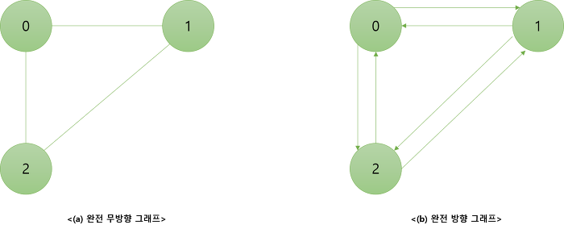

# Udemy : 알고리즘 DFS, BFS, 백트래킹

*udemy 알고리즘 코딩 테스트*


## 그래프 자료구조

> #### 그래프는 노드와 링크로 이루어진 자료구조다
>
> #### 노드는 점들이고, 노드를 이어주는 링크, Edge 또는 간선이라고 한다


#### SNS / 메신저 관계도를 그래프로 만들 수 있다

#### 지도 / 네비게이션 같이 그래프를 실생활에 사용될 수 있다


#### 무방향 또는 방향 그래프로 만들 수 있다

- 무방향이나 양방향 그래프는 동일한 개념이다




## 트리 자료구조

> #### 순환성이 없는 무방향 그래프다


#### 코드를 그래프로 나타날 때에는 인접 리스트와 행열을 만들 수 있다


#### 연결 행


#### 연결 리스트


## DFS (Depth First Search)

> #### 깊이 우선 탐색

- 스택 또는 재귀를 사용해서 구현을 한다
- DFS는 완전 탐색이다


## BFS (Breadth First Search)

> #### 너비 우선 탐색
>
> #### 최단 거리를 구할 때에 유리할 수 있다

- 완전 탐색이다
- 큐를 이용해서 구현한다


## 백트래킹

#### 모든 경우를 탐색한다

#### 가지치기를 통해 탐색 경우의 수를 줄인다

- 가능한 덜 탐색하는 것


## 문제 풀이

#### 11724 연결 요소의 개수

- DFS를 하며, DFS가 한번 끝날 때, 연결 요소 하나를 세어주면 된다

```python
def dfs(start):
    for s in links[start]:
        if visited[s] == False:
            visited[s] = True
            dfs(s)

N, M = map(int, input().split())

visited = [False for _ in range(N + 1)]
links = [[] for n in range(N + 1)]

for m in range(M):
    a, b = map(int, input().split())
    links[a].append(b)
    links[b].append(a)

count = 0

for index in range(1, len(visited)):
    if visited[index] == False:
        dfs(index)
        count += 1

print(count)
```


#### 2178 - 미로 탐색

```python
from collections import deque

N, M = map(int, input().split())

matrix = [list(map(int, input())) for _ in range(N)]
visited = [[0] * M for _ in range(N)]

dr, dc = [-1, 0, 0, 1], [0, -1, 1, 0]


queue = deque([(0, 0)])
visited[0][0] = 1

while queue:
    row, column = queue.popleft()

    for i in range(4):
        sr, sc = row + dr[i], column + dc[i]

        if 0 <= sr < N and 0 <= sc < M:
            if matrix[sr][sc] == 1 and visited[sr][sc] == 0:
                visited[sr][sc] = visited[row][column] + 1
                queue.append((sr, sc))
            

print(visited[N-1][M-1])
```


